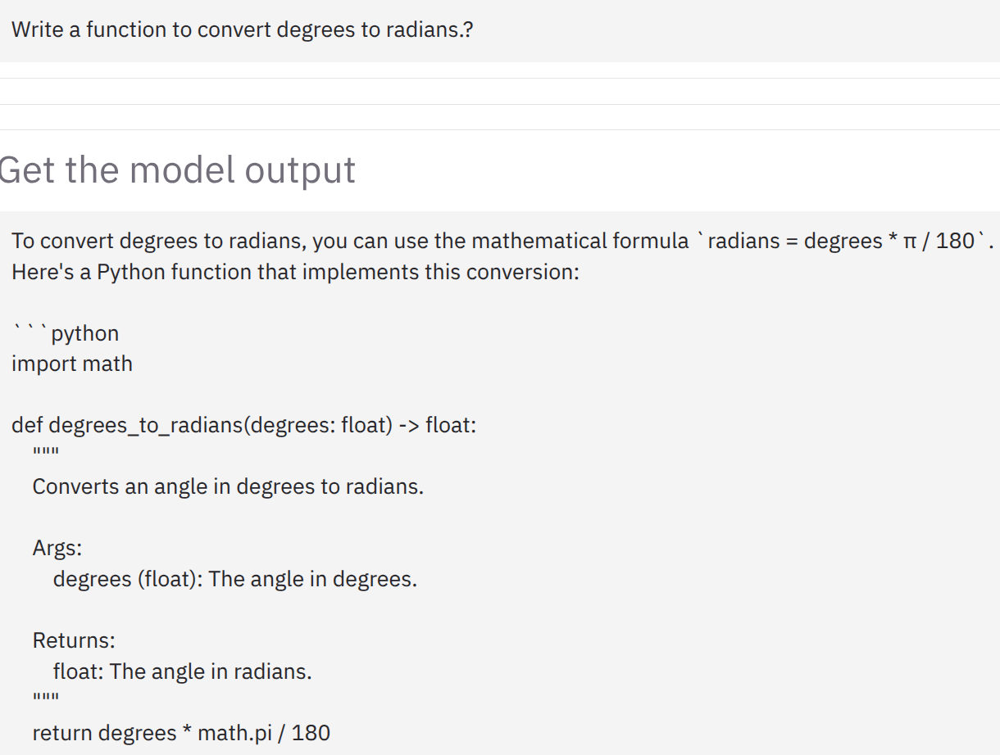

# iRAT: Improved Retrieval-Augmented Thinking for Context-Aware Reasoning
**Team members:** \
Praneeth Vadlapati ([@prane-eth](https://github.com/prane-eth)) \<praneeth.vad@gmail.com\> \
Aryan Singh ([@ekk012](https://github.com/ekk012)) \<aryansingh729@gmail.com\> \
Zeeshan Ali ([@zeeshan5k](https://github.com/zeeshan5k)) \
Alvaro Arteaga ([@LagrangianPoint](https://github.com/LagrangianPoint))

## Demo
Screenshots are available in the [Demo](Demo) folder.


## Setup steps
1. Clone the repository
```bash
git clone https://github.com/prane-eth/iRAT
```
2. Open a terminal in the "**iRAT**" folder and install the required packages
```bash
pip install -r requirements.txt
```
<!-- 3. (Optional) Install Chromium browser for Playwright to load web data from more sites.
```bash
playwright install chromium
``` -->
4. Ensure the environment file (.env) is set up with correct values, based on ".env.example" file.
5. To host the models, run:
```bash
python host_models.py
```
6. To test the pipeline, run the following command in the terminal in "irat" folder:
```bash
python irat/pipeline.py
```
7. To host the server and use the web page, run the following command in the terminal in "irat" folder:
```bash
python irat/server.py
```


## Evaluation steps:
1. Create response data using [evaluation/create_responses.py](evaluation/create_responses.py).
2. Evaluate the responses using [evaluation/process_responses.ipynb](evaluation/process_responses.ipynb).

## Sample:


## Architecture:

Full architecture: (Credits: Zeeshan Ali)


---

# Base paper:
## RAT: Retrieval Augmented Thoughts Elicit Context-Aware Reasoning and Verification in Long-Horizon Generation
[[GitHub]](https://github.com/CraftJarvis/RAT)
[[Website]](https://craftjarvis.github.io/RAT/)
[[Published Paper]](https://neurips.cc/virtual/2024/100974)
[[Pre-print]](https://arxiv.org/abs/2403.05313)
