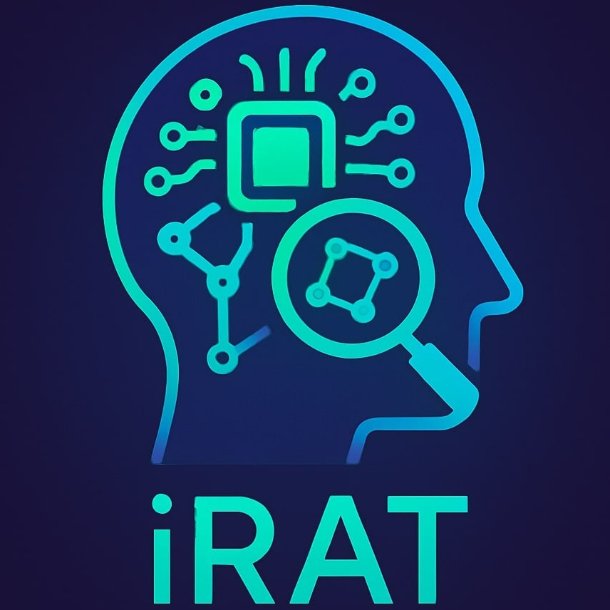
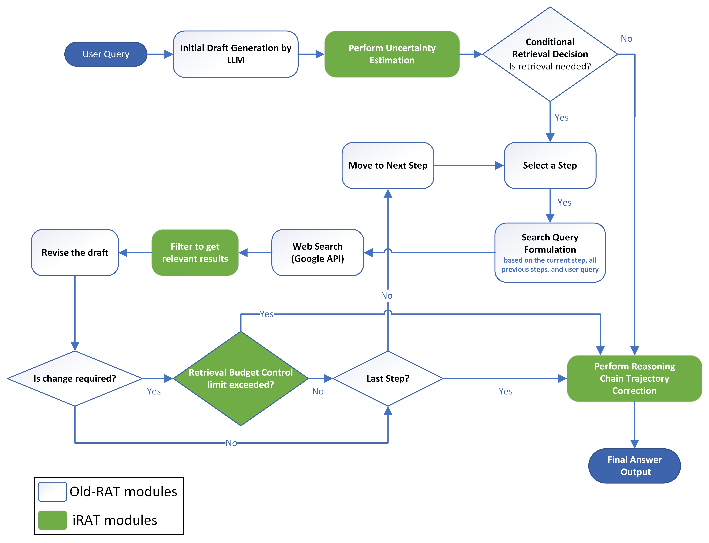

# _iRAT_: Replanning and Controlled Retrieval for Robust LLM Reasoning

[](./LICENSE.md)
[](https://www.preprints.org/manuscript/202507.1289)
[](https://www.python.org/)
<!-- [](https://doi.org/10.XXXXX/XXXXX) -->
<!-- [](https://medium.com/@praneeth.v/<link here>) -->

<br>

> [!NOTE]
> Please star :star: the repository to show your support. <br>


## Architecture:




## Setup steps
1. Clone the repository
```bash
git clone https://github.com/prane-eth/iRAT
```
2. Open a terminal in the "**iRAT**" folder and install the required packages
```bash
pip install -r requirements.txt
```
3. Ensure the environment file (.env) is set up with correct values, based on ".env.example" file.
4. To host the models, run:
```bash
python host_models.py
```
5. To test the pipeline, run the following command in the terminal in "irat" folder:
```bash
python pipeline.py
```
6. To start the web server, run:
```bash
python server.py
```

## Demo
Screenshots are available in the [Demo](Demo) folder.

## :identification_card: License
Copyright © 2025 Praneeth Vadlapati and team <br>
Please refer to the [LICENSE](./LICENSE.md) file for more information. <br>
To request a permission to use my work, please contact me using the link below.

## :warning: Disclaimer
The code is not intended for use in production environments.
This code is for educational and research purposes only.
No author is responsible for any misuse or damage caused by this code.
Use it at your own risk. The code is provided as is without any guarantees or warranty.


## Team members:
Praneeth Vadlapati ([@prane-eth](https://github.com/prane-eth)) \<praneeth.vad@gmail.com\> \
Zeeshan Ali ([@zeeshan5k](https://github.com/zeeshan5k)) \
Aryan Singh ([@ekk012](https://github.com/ekk012)) \<aryansingh729@gmail.com\> \
Alvaro Arteaga ([@LagrangianPoint](https://github.com/LagrangianPoint))

## Contributions:
- **Praneeth Vadlapati**: Pipeline, result-filter module, evaluation, most of the code and paper, and team leadership.
- **Zeeshan Ali**: Architecture, uncertainty evaluation, and Chain Evaluator model.
- **Aryan Singh**: Retrieval module with budget control, dataset analysis, MBPP pre-processing, pipeline wireframe, and bug fixing in budget control.
- **Alvaro Arteaga**: User input scanning, and the idea of spam website filter.

## :email: Contact
For personal queries, please find Praneeth's contact details here: [linktr.ee/prane.eth](https://linktr.ee/prane.eth)

---

# Base paper:
## RAT: Retrieval Augmented Thoughts Elicit Context-Aware Reasoning and Verification in Long-Horizon Generation
[[GitHub]](https://github.com/CraftJarvis/RAT)
[[Website]](https://craftjarvis.github.io/RAT/)
[[Published Paper]](https://neurips.cc/virtual/2024/100974)
[[Pre-print]](https://arxiv.org/abs/2403.05313)
