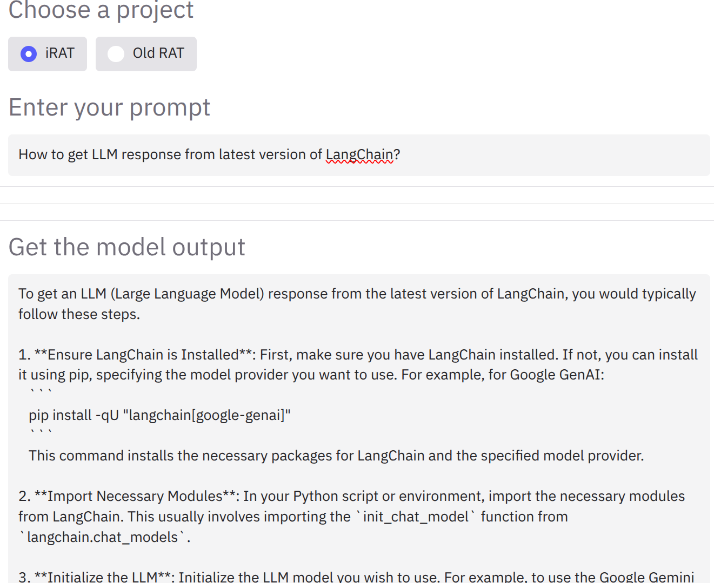
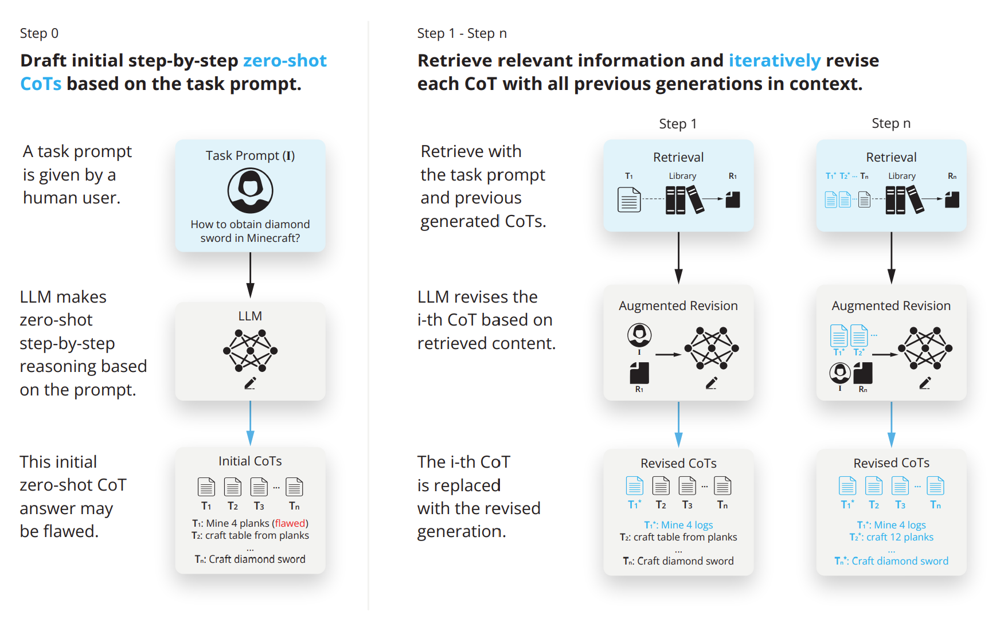
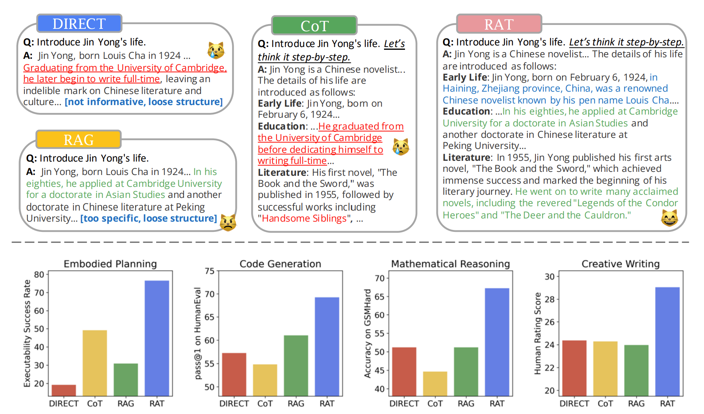

# iRAT: Improved Retrieval-Augmented Thinking for Context-Aware Reasoning
**Team members:** \
Praneeth Vadlapati ([@prane-eth](https://github.com/prane-eth)) \<praneeth.vad@gmail.com\> \
Aryan Singh ([@ekk012](https://github.com/ekk012)) \<aryansingh729@gmail.com\> \
Zeeshan Ali ([@zeeshan5k](https://github.com/zeeshan5k)) \
Alvaro Arteaga ([@LagrangianPoint](https://github.com/LagrangianPoint))

## Demo
Screenshots are available in the [Demo](Demo) folder.


## Setup steps
1. Clone the repository
```bash
git clone https://github.com/prane-eth/iRAT
```
2. Install the required packages
```bash
pip install -r requirements.txt
```
3. Run 
```bash
playwright install chromium
```
4. Ensure the environment file (.env) is set up with correct values, based on ".env.example" file.
5. To host the models, run
```bash
python host_models.py
```
6. To test the pipeline, run
```bash
python irat/pipeline.py
```
7. To host the server, run
```bash
python irat/server.py
```

## Proposed Folder structure:
```
├── irat/               # Main Python package
│	├── utils/                    # Utilities (code shared between modules, methods and classes)
│	├── __init__.py               # Package initialization file
│	├── lm_adapter.py             # Wraps OpenAI/Transformers calls for “initial draft”
│	├── uncertainty.py            # Uncertainty‐estimation logic
│	├── retrieval.py              # Conditional retrieval decision & budget control
│	├── budget_control.py         # Budget tracking for multiple retrievals
│	├── result_filter.py          # Filtering raw search results using "Attention‐Retrieval" method
│	├── draft_revision.py         # Draft revision using retrieved text
│	├── reflection_replanning.py  # Reflection & replanning logic
│	├── pipeline.py               # Orchestrates the end-to-end iRAT flow
│	└── server.py                 # Allows to run the iRAT pipeline as a web service
│
├── tests/              # Unit tests
│	├── test_lm_adapter.py
│	├── test_uncertainty.py
│	├── test_retrieval.py
│	├── test_budget_control.py
│	├── test_result_filter.py
│	├── test_draft_revision.py
│	├── test_reflection_replanning.py
│	├── test_dynamic_prompt.py
│	├── test_pipeline.py
│	├── test_utils.py
│	├── test_settings.py
│	└── test_original_rat.py      # To test the original RAT implementation
│
├── requirements.txt    # Python Dependencies
├── .env.example        # Template to create `.env` file to set environment variables such as API keys
│── notebooks/          # Jupyter notebooks used for experimentation
├── README.md           # Project documentation
├── assets/             # Assets for the project (images, diagrams, etc.)
└── LICENSE.md          # License file
```

## Running Tests
We are making use of PyTest for performing unit tests. To run all of them, run:
```
pytest tests/
```

To run a specific test file run: 
```
pytest tests/test_settings.py
```

To debug a specific test file and output any print statements use:
```
pytest tests/test_settings.py -s
```


## Sample:



---

# Base paper:
## RAT: Retrieval Augmented Thoughts Elicit Context-Aware Reasoning in Long-Horizon Generation
[[GitHub]](https://github.com/CraftJarvis/RAT)
[[Website]](https://craftjarvis.github.io/RAT/)
[[Paper]](https://arxiv.org/abs/2403.05313)



### Abstract 

We explore how iterative revising a chain of thoughts with the help of information retrieval significantly improves large language models' reasoning and generation ability in long-horizon generation tasks, while hugely mitigating hallucination. In particular, the proposed method — retrieval-augmented thoughts (RAT) — revises each thought step one by one with retrieved information relevant to the task query, the current and the past thought steps, after the initial zero-shot CoT is generated.




